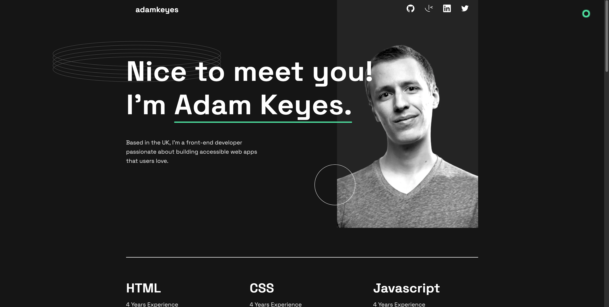

<a name='#readme-top' ></a>

# Frontend Mentor - Single-page developer portfolio

## Table of contents

- [Overview](#overview)
  - [The challenge](#the-challenge)
  - [Built with](#built-with)
  - [Screenshot](#screenshot)
- [My process](#my-process)

  - [What I learned](#what-i-learned)
  - [Useful resources](#useful-resources)

  <br><br>

## Overview

I am presenting a Portfolio landing page designed to enhance user experience with smooth animations. In addition, it offers a responsive layout, ensuring compatibility across modern devices. The animations on this website are achieved using the Javascript library called GreenSock(GSAP). I found coding with GSAP to be a pleasant experience, as it simplified the process of creating animations and reduced the amount of code required. Although I implemented the basics of GSAP, the website looks more captivating.

### The Challange

Users should be able to:

- Receive an error message when the form is submitted if:
  - Any field is empty
  - The email address is not formatted correctly
- View the optimal layout for the interface depending on their device's screen size
  <br><br>

### Built with

<br>

 &nbsp;&nbsp;
 &nbsp;&nbsp;
 &nbsp;&nbsp;
 &nbsp;&nbsp;

<p align="right">(<a href="#readme-top">back to top</a>)</p>

<br>

### Screenshot

<br>



<p align="right">(<a href="#readme-top">back to top</a>)</p>

<br>

## My process

<br>

### What I learned

<br>

**1. Creating a cursor with HTML, CSS, Javascript.**

<br>

```html
<!-- I created in my project multiple circles -->
<div class="cursor">
  <div></div>
  <div></div>
  <div></div>
  <div></div>
  <div></div>
</div>
```

```css
/* Appropriate styling for the cursors */
.cursor div {
  position: absolute;
  top: 0;
  left: 0;
  width: 16px;
  height: 16px;
  border-radius: 50%;
  z-index: 10000;
  border: 1px solid var(--clr-primary);
  box-shadow: 2px 2px 3px #4ee1a0, -2px -2px 3px #4ee1a0, 2px -2px 3px #4ee1a0, -2px
      2px 3px #4ee1a0;
  /* Prevent from getting in the way when links are clicked */
  pointer-events: none;
  /* Move the ball to the center of the cursor */
  transform: translate(-50%, -50%);
  opacity: 1;
  transition: opacity 0.3s;
}
```

```js
//Cursor
const cursor = document.querySelector('.cursor');
const circles = cursor.querySelectorAll('div');

let aimX = 0;
let aimY = 0;

circles.forEach((circle, i) => {
  let currentX = 0;
  let currentY = 0;
  //You change the speed to make the circles move faster or slower
  let speed = 0.2 + i * 0.025;

  const animate = () => {
    currentX += (aimX - currentX) * speed;
    currentY += (aimY - currentY) * speed;

    circle.style.left = currentX + 'px';
    circle.style.top = currentY + 'px';

    requestAnimationFrame(animate);
  };

  animate();
});

//Animate cursor
document.addEventListener('mousemove', (event) => {
  aimX = event.pageX;
  aimY = event.pageY;
});
```

**2. Basics of GSAP**
<br><br>

### Useful resources

- [How to make a custom mouse cursor with Javascript Video](https://www.youtube.com/watch?v=uprZMdVl-aQ&t=1293s) - In this tutorial, Rik talks about how to use HTML, CSS and Javascript to add a mouse trail effect to your websites and then how to add in a hover effect where hidden text is revealed to your users! <br>
- [GreenSock Dcumentation](https://greensock.com/gsap/) - The GSAP documentation is very well-written and beginner friendly. <br>
- [Creative Coding Club Videos](https://www.creativecodingclub.com/bundles/creative-coding-club) - If you prefer watching videos, the creative coding club is the right place to learn about GreenSock library. With small projects, everything is well explained to enhance what you have learned.
